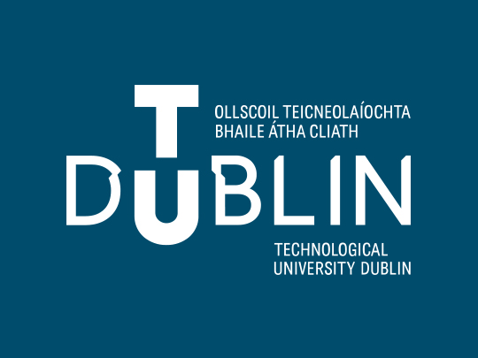

```{r setup, include=FALSE}
knitr::opts_chunk$set(echo = FALSE)

# Learn more about creating websites with Distill at:
# https://rstudio.github.io/distill/website.html

# Learn more about publishing to GitHub Pages at:
# https://rstudio.github.io/distill/publish_website.html#github-pages

```

```{r meta, echo=FALSE}
library(metathis)
meta() %>%
  meta_general(
    description = "An Introduction to ggplot for TUD",
    generator = "xaringan and remark.js"
  ) %>% 
  meta_name("github-repo" = "eugene100hickey/GRS-2022") %>% 
  meta_social(
    title = "Introduction to ggplot",
    url = "",
    image = "slides/img/sunset.JPG",
    image_alt = paste(
      "Title slide of Introduction to ggplot:",
      "An Introduction to data visualisations using ggplot",
      "Workshop presented by Eugene Hickey"
      ),
    og_type = "website",
    og_author = "Eugene Hickey",
    twitter_card_type = "summary_large_image",
    twitter_creator = "@eugene100hickey"
  )
```

# Welcome

This is the course site for the _Data Visualisation_ workshop created by Eugene Hickey for [TU Dublin](https://tudublin.ie).

<aside>
```{r, out.height=125}

```
</aside>

This five-hour hands-on workshop will be a gentle introduction to  [ggplot](https://ggplot2.tidyverse.org/reference/ggplot.html) package as a tool to create impressive graphics and data visualisations.

- **The Morning** will discuss the overall structure of [ggplot](https://ggplot2.tidyverse.org/reference/ggplot.html) and we'll start doing some initial plots; barcharts, boxplots, histograms, point/line plots.....

<aside>
Wednesday, March 9th<br/>10-1pm BST ([check your time zone](https://www.worldtimebuddy.com/?qm=1&lid=2964574,360630,524901&h=2964574&date=2022-3-9&sln=10-13&hf=1
))
</aside>

```{r embed-xaringan-01, echo=FALSE}
xaringanExtra::embed_xaringan(url = "https://grs-2022.netlify.app/slides/01-why-ggplot.html", ratio = "16:9")
```


```{r embed-xaringan-01a, echo=FALSE}
xaringanExtra::embed_xaringan(url = "https://grs-2022.netlify.app/slides/02_R.html", ratio = "16:9")
```

```{r embed-xaringan-02, echo=FALSE}
xaringanExtra::embed_xaringan(url = "https://grs-2022.netlify.app/slides/02-proportions.html", ratio = "16:9")
```


```{r embed-xaringan-03, echo=FALSE}
xaringanExtra::embed_xaringan(url = "https://grs-2022.netlify.app/slides/03-distributions-relationships.html", ratio = "16:9")
```

- **The Afternoon** will cover colours, themes, facets, and fonts.


```{r embed-xaringan-04, echo=FALSE}
xaringanExtra::embed_xaringan(url = "https://grs-2022.netlify.app/slides/04-colours.html", ratio = "16:9")
```


```{r embed-xaringan-05, echo=FALSE}
xaringanExtra::embed_xaringan(url = "https://grs-2022.netlify.app/slides/05-themes.html", ratio = "16:9")
```
<aside>
Wednesday, March 9th<br/>2-4pm BST ([check your time zone](https://www.worldtimebuddy.com/?qm=1&lid=2964574,360630,524901&h=2964574&date=2022-3-9&sln=14-16&hf=1))
</aside>

This workshop is designed for people looking for new tools to present their data.

# Prework

## Essential

We'll be using the software listed below.

- Install [R](https://cloud.r-project.org/) and [RStudio Desktop](https://rstudio.com/products/rstudio/download/) on your computer. 

You can find step-by-step instructions for installing these here: [macOS](https://www.youtube.com/watch?v=GM88tYlEy_g), [Windows](https://www.youtube.com/watch?v=JRKmZK5-6aE).


- Install the following packages:

```{r, eval=FALSE, echo=TRUE}
# From CRAN
list_of_pkgs <- c("tidyverse")

# run the following line of code to install the packages you currently do not have
new_pkgs <- list_of_pkgs[!(list_of_pkgs %in% installed.packages()[,"Package"])]
if(length(new_pkgs)) install.packages(new_pkgs)
```

# Links

- Link to this website:

# Acknowledgments {.appendix}

This workshop draws from various sources, most notably the books by [Kieran Healy](https://socviz.co/) and [Claus Wilkie](https://clauswilke.com/dataviz/). I'd also like to mention the webpage of [The Top 50 ggplot2 Visualisations](http://r-statistics.co/Top50-Ggplot2-Visualizations-MasterList-R-Code.html). This workshop ran smoothly with the help of [Raffaella Salvante](raffaella.salvante@tudublin.ie) as co-pilot.

This website was made with the [distill package](https://rstudio.github.io/distill/) and a custom theme designed by Silvia Canelón.
