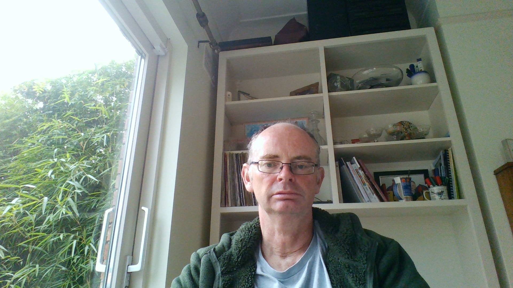

```{r meta, echo=FALSE, message=FALSE, warning=FALSE}
library(metathis)
meta() %>%
  meta_general(
    description = "An Introduction ggplot",
    generator = "xaringan and remark.js"
  ) %>% 
  meta_name("github-repo" = "eugene100hickey/grs-2022") %>% 
  meta_social(
    title = "Introduction to ggplot",
    url = "https://grs-2022.netlify.app",
    image = "https://github.com/eugene100hickey/blob/main/moon.png",
    image_alt = "Front page for Introduction to ggplot",
    og_type = "website",
    og_author = "Eugene Hickey",
    twitter_card_type = "summary_large_image",
    twitter_creator = "@eugene100hickey"
  )
```

```{r setup, include = FALSE}
# .libPaths(c(.libPaths(), "C:\\Users\\ehickey\\OneDrive - Technological University Dublin\\Documents\\R\\win-library\\4.0"))

options(htmltools.dir.version = FALSE)
library(knitr)
library(tidyverse)
library(xaringanExtra)
# library(NHSRtheme)
# library(NHSRdatasets)
library(flipbookr)
library(factoextra)
# set default options
opts_chunk$set(echo=FALSE,
               collapse = TRUE,
               fig.width = 7.252,
               fig.height = 4,
               dpi = 300,
               cache = TRUE,
               message = FALSE,
               warning = FALSE)

xaringanExtra::use_tile_view()
xaringanExtra::use_panelset()
xaringanExtra::use_clipboard()
xaringanExtra::use_webcam()
xaringanExtra::use_broadcast()
xaringanExtra::use_share_again()
xaringanExtra::style_share_again(
  share_buttons = c("twitter", "linkedin", "pocket")
)

```


class: title-slide, right, top
background-image: url(img/moon.JPG)
background-position: 90% 75%, 75% 75%
background-size:cover

.left-column[
# `r rmarkdown::metadata$title`
] 

.right-column[
### `r rmarkdown::metadata$subtitle`

**`r rmarkdown::metadata$author`**<br>
`r rmarkdown::metadata$date`
]


.palegrey[.left[.footnote[Graphic by [Elaine Hickey](https://photos.google.com/photo/AF1QipMjKNoaxyne8nte4HmxA6Th9-4fUfSbl_mx-_1G)]]]

???

Welcome to the workshop on ggplot.

Where we'll show you how to create impressive data visualisations.

---
name: about-me
layout: false
class: about-me-slide, inverse, middle, center

# About me



## Eugene Hickey

### lecturer in physics

.fade[Technological University<br>Dublin]

[`r icons::fontawesome("link")` www.fizzics.ie](https://www.fizzics.ie)
[`r icons::fontawesome("twitter")` @eugene100hickey](https://twitter.com/eugene100hickey)
[`r icons::icon_style(icons::fontawesome("github"), scale = 1)` eugene100hickey](https://github.com/eugene100hickey)

---
layout: true

<a class="footer-link" href="http://grs-2023.netlify.app">data-visualisation-grs2023 &mdash; Eugene Hickey</a>

<!-- this adds the link footer to all slides, depends on footer-link class in css-->

---
class: top

# Acknowledgments

.pull-left-narrow[.center[]]

.pull-right-wide[
[Giovanna](https://www.tudublin.ie/research/postgraduate-research/graduate-research-school/meet-the-team/giovannarampazzo.html), co-pilot for this workshop and administrator of the Graduate Research School.
]

--

.pull-left-narrow[.center[
]]

.pull-right-wide[
[Graduate Research School](https://www.tudublin.ie/research/postgraduate-research/graduate-research-school/) for the opportunity to provide this workshop
]

--

.pull-left-narrow[.center[
`r icons::icon_style(icons::fontawesome("smile"), scale = 3, fill = "#e5bf00")`]]

.pull-right-wide[
- [xaringan `r emo::ji("package")`](https://github.com/yihui/xaringan#xaringan) developed by Yihui Xie
- [flipbookr `r emo::ji("package")`](https://github.com/EvaMaeRey/flipbookr) developed by Gina Reynolds
- [learnr `r emo::ji("package")`](https://github.com/rstudio/learnr) developed by Garrick Aden-Buie
]

---

# Target Audience

- graduate students looking for better ways to present their data  

- people currently using tools like MS Excel for visualisations

---

# Why R?

- working with a mouse isn't reproducible  
  - difficult to log exactly what you've done
  - hard to repeat for a series of diagrams
  - difficult to be inspired by other people's work
  
- good to separate sources of data and the visualisations that disply them

- R uses series of commands that input, manipulate, and display data

- lots of contributors around the world, diverse fields

---

# Course Contents

1. System Configuration - installing software
2. Using RStudio
3. Introduction to R
4. Getting and Cleaning Data
5. Exploratory Analysis - making rough plots
6. Different Types of Plots
7. Playing with Aesthetics
8. Using Plotting Themes
9. Advanced Topics - Maps, Networks

---

## Why We're Here

- Alternative to Excel, and Tableau
- Enables Reproducible Research
- Can Make Lots of Plots Quickly
    - Good for Exploratory Analysis
- Publication Ready Figures

---

## And.... a gateway to so much more

- data capture
- statistical analysis
- machine learning
- artificial intelligence
- writing your thesis
- writing a blog

---

## Not Why We're Here

- Won't discuss choices for data presentation
- Nor good practices in visualisations
    - but these are sort of in the background
- This isn't a machine learning course
    - but lots of the techniques we'll use are relevant
- So, this course it about skills development, how you use these is up to you.

---

## We said we wouldn't discuss this....but

- Graphics are important, overlooked, and inconsistent
   - the last mile of data analysis
- Need to tell a story
- Can be misleading, almost always by accident
- Choice of colours - we'll spend some time on this
- Choice of fonts
- Keep it simple - reduce amount of ink
- Increasing number of options for showcasing your data

---


# Lots of addin packages for ggplot


`r read_csv("data/my-packages.csv")$packages`


---

# And others, that make ggplots that can then be modified and treated as such

```{r}
pi
```


---

# Other reasons

- ggplot is easy to make publication-ready  

- easier to make sequence of visualisations  

- fits in nicely with the rest of the tidyverse


---
class: center, inverse

# Let's Begin

---

## Install R and RStudio

---

### *R*
- Go to [*CRAN*](https://cran.r-project.org/)

### *RStudio*

- this is the IDE we will use (and pretty much everyone else uses)
- R is the engine, RStudio is the cockpit
- download from [*RStudio*](https://rstudio.com/products/rstudio/download/)

---

## Using RStudio 

- toolbar across the top
    - I don't use this very much
- set of quick links below that
    - top left (green plus sign) is about the only one I use
- 4 Panes
    - top left for files or looking at data
    - bottom left for the console
    - top right for *Environment* - tells what variables are stored
    - bottom right for plots and help
    
---

[This](https://learnr-examples.shinyapps.io/ex-setup-r/#section-welcome) is a nice tutorial suite to explain installing R and RStudio:

---

 

---

- usual work flow is:
    - try commands out at the console (bottom left)
    - when that works, store them in a file (top left)
    - when sequence of commands works, put them into a document (also top left)

---
 
## Extending R

- installing R just gives you *base* R
- beauty of this tool lies with *packages*
- we'll look at installing these from three sources:
    - CRAN
    - Bioconductor
    - github

---

- [CRAN](https://cran.r-project.org/) 
    - example, on console type *install.packages("tidyverse")*
    - this installs the tidyverse package (or rather, family of packages)
    - over 20k packages on CRAN (see list [here](http://cran.nexr.com/web/packages/available_packages_by_name.html))
    - sometimes esoteric ([engsoccerdata](http://cran.nexr.com/web/packages/engsoccerdata/index.html))
    - sometimes cutting edge ([deep learning](http://cran.nexr.com/web/packages/keras/index.html))
    - each package heavily curated and maintained
    
---

- [Bioconductor](www.bioconductor.org)
    - set of bioinformatics packages (lots of genomics)
    - start with *install.packages("BiocManager")*
    - then *BiocManager::install("some_genomics_package")* to use
    - list of packages [here](http://bioconductor.org/packages/release/BiocViews.html)
    - about 3,000 packages, including genome builds
    
---

- github
    - packages in development
    - start with *install.packages("devtools")*
    - then *devtools::install_github("developer_name/package_name")*
    - almost 80k packages [here](http://rpkg.gepuro.net/)
    - the package *githubinstall* is useful to search these
   
---

background-position: center
background-size: contain
class: center, inverse    
    
# Resources

- [Big Book of R](https://www.bigbookofr.com/index.html)
---

- books
    - *recommended text* **Data Visualization** by Kieran Healy (ISBN = 978-0691181622). ~€25. Also online at [https://socviz.co/index.html](https://socviz.co/index.html)
    - [Hadley's book, R for Data Science](https://r4ds.had.co.nz/)
    - [Hadley's book on ggplo2](https://ggplot2-book.org/)
    - [Data Visualization by Wilke](https://serialmentor.com/dataviz/), lots of his actual code is on github at [https://github.com/clauswilke/practical_ggplot2](https://github.com/clauswilke/practical_ggplot2)
    - check out the list of online books at [bookdown.org](bookdown.org)


---

- websites
    - Karl Broman (https://www.biostat.wisc.edu/~kbroman/), and particularly [this presentation](https://www.biostat.wisc.edu/~kbroman/presentations/graphs_MDPhD2014.pdf)
    - course by Boemhke on github [github.com/uc-r/Intro-R](https://github.com/uc-r/Intro-R)
    - the good people at RStudio have lots of help at [resources.rstudio.com/](https://resources.rstudio.com/)
    - [Cedric](https://cedricscherer.netlify.com/2019/08/05/a-ggplot2-tutorial-for-beautiful-plotting-in-r/). 
    - [The R Graph Gallery](https://www.r-graph-gallery.com/index.html) is pretty good and worth checking out
    
<br/>  
<br/>
<br/>
    
    
---

- Blogs and Podcasts
    - [www.simplystatistics.org](www.simplystatistics.org)
    - [varianceexplained.org](http://varianceexplained.org/)
    - [Not So Standard Deviations](http://nssdeviations.com/)
    - [Thomas Lin Pedersen video](https://github.com/thomasp85/ggplot2_workshop)
    

<br/>
<br/>
<br/>
<br/>
<br/>
<br/>


    
    
---

- Online Courses
    - Coursera: [Data Science from Johns Hopkins](https://www.coursera.org/specializations/jhu-data-science). The course notes are on [github](http://datasciencespecialization.github.io/)
    - edx.org [course from Irizarry](https://www.edx.org/course/data-science-visualization)
    - [datacamp](www.datacamp.com)
    
<br/>  
<br/>
<br/>
<br/>
<br/>
<br/>


    
---

- Miscellaneous
    - [Dublin R MeetUp](https://www.meetup.com/DublinR/) 
    - [RWeekly.org](rweekly.org), round up of events in the world of R
    - [#Rstats on twitter](https://twitter.com/search?q=%23rstats&src=typed_query)
    - [#TidyTuesday](https://twitter.com/search?q=%23TidyTuesday&src=typeahead_click) on twitter
    - [R Cheatsheets](https://rstudio.com/resources/cheatsheets/)
    - if you get stuck, google is your friend. Often sends you to stackoverflow.com or stackexchange.com
    
---

- Some stuff about graphics in general
    - [again, from Irizarry](http://genomicsclass.github.io/book/pages/plots_to_avoid.html)
    - [hit parade of graphs in R](https://www.r-graph-gallery.com/index.html)
    - [Cedric Scherer again](https://cedricscherer.netlify.com/)
    - some stuff from [Christian Burkhard](https://ggplot2tor.com/make_any_plot_look_better/make_any_plot_look_better/)
    - and from [Laura Ellis](https://www.littlemissdata.com/)
    - and from [Peter Aldhous](http://paldhous.github.io/ucb/2016/dataviz/)
    - [colours in R](https://www.nceas.ucsb.edu/~frazier/RSpatialGuides/colorPaletteCheatsheet.pdf)
    - cool book on good graphics from [Stephen Few](https://nces.ed.gov/programs/slds/pdf/08_F_06.pdf)
    - [The Glamour of Graphics](https://www.williamrchase.com/slides/assets/player/KeynoteDHTMLPlayer.html#0) talk from last months RStudio Conference
   
---


