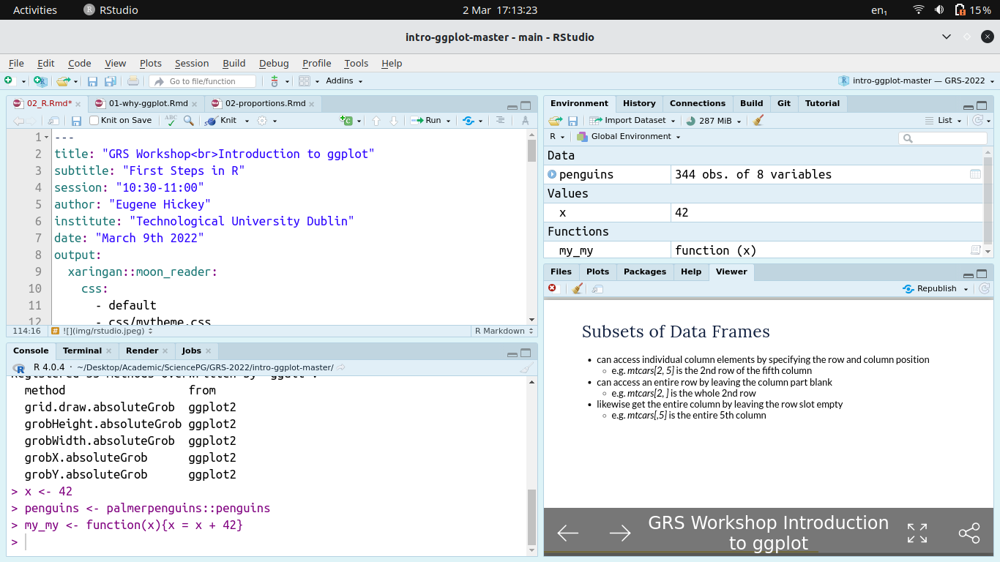

```{r meta, echo=FALSE, message=FALSE, warning=FALSE}
library(metathis)
meta() %>%
  meta_general(
    description = "An Introduction ggplot",
    generator = "xaringan and remark.js"
  ) %>% 
  meta_name("github-repo" = "eugene100hickey/grs-2022") %>% 
  meta_social(
    title = "Introduction to ggplot",
    url = "https://grs-2022.netlify.app",
    image = "https://github.com/eugene100hickey/blob/main/dawn.JPG",
    image_alt = "Front page for Introduction to ggplot",
    og_type = "website",
    og_author = "Eugene Hickey",
    twitter_card_type = "summary_large_image",
    twitter_creator = "@eugene100hickey"
  )
```

```{r setup, include = FALSE}
options(htmltools.dir.version = FALSE)
library(knitr)
library(tidyverse)
library(xaringanExtra)
library(flipbookr)
# set default options
opts_chunk$set(echo=FALSE,
               collapse = TRUE,
               fig.width = 7.252,
               fig.height = 4,
               dpi = 300,
               cache = TRUE,
               message = FALSE,
               warning = FALSE)

xaringanExtra::use_tile_view()
xaringanExtra::use_panelset()
xaringanExtra::use_clipboard()
xaringanExtra::use_webcam()
xaringanExtra::use_broadcast()
xaringanExtra::use_share_again()
xaringanExtra::style_share_again(
  share_buttons = c("twitter", "linkedin", "pocket")
)

```

class: title-slide, right, top
background-image: url(img/dawn.JPG)
background-position: 90% 75%, 75% 75%
background-size:cover

.left-column[
# `r rmarkdown::metadata$title`
] 

.right-column[
### `r rmarkdown::metadata$subtitle`

**`r rmarkdown::metadata$author`**<br>
`r rmarkdown::metadata$date`
]


.palegrey[.left[.footnote[Graphic by [Elaine Hickey](https://photos.google.com/photo/AF1QipMjKNoaxyne8nte4HmxA6Th9-4fUfSbl_mx-_1G)]]]

???

Welcome to the workshop on ggplot.

Where we'll show you how to create impressive data visualisations.

---

class: center, inverse

# Introduction to R Programming
<br>
<br>
<br>
### R is case sensitive

---

---

<ol>
<li> Using the Console
<li> Storing Values
<li> Fundamental Data Types
<li> The Dataframe - Rows $\times$ Columns
<li> Dataframe Columns
<li> Subsets of Dataframes
<li> Small Useful Functions
---

## Using the Console

- R is a calculator
- can type, say, 45 + 17 and get the answer back
- _\*_ is multiply, _/_ is divide
- get constants like _pi_ for $\pi$
- can run functions from the console like, say, _sqrt(x=49)_ (or just _sqrt(49)_)
- can get help on these functions by typing, say,  _?sqrt_
- to get list of help in the base package try _base::_ and then press _tab_

---

## Storing Values

- results of calculations can be stored
- do this with _my_square_root_result <- sqrt(49)_
- the _<-_ reads as _gets_ (can also us equals sign, _=_, but that's sloppy)
- keep board short cut for _<-_ is _alt_ and _-_ simultaneously
- full list of RStudio shortcuts in _Help_ on the toolbar (ironically, of course, there is a keyboard shortcut for keyboard shortcuts help)
- list of stored values given in the _Environment_ tab of RStudio

---

## Fundamental Data Types

- _numeric_ (or _double_) is for numbers with decimals. Default for numbers.
- _integer_ for counting numbers. Type in _x <- 72L_ to get integer 72
- _logical_ gives _TRUE_ and _FALSE_
- _character_ gives text. Try typing _x <- "I am Groot"_. Equivalent is _x <- 'I am Groot'_
- _complex_ is for stuff like _14 + 3i_. I've never used these. Ironically _sqrt(-1)_ gives an error rather than _i_
- _factor_. These deserve fuller explanation and get a slide of their own.

---

## Factors

- super useful when only limited number of possible values for a variable
- examples like _female_ / _male_ or _Alabama_ / _Alaska_ / .... _Wyoming_
- possible values are called _levels_
- levels have an order, default is alphabetical but can adjust this
- _forcats_ package in the tidyverse deals with factors
- have big impact on figures
    - figures will look different depending on whether a variable is a factor or a character
    - legend will be in the order of levels of a factor
    
    
---

- can change between data types using the _as._ functions
    - e.g. _as.character()_, _as.numeric()_
    - check out all the function in _forcats_ for dealing with factors
- can figure out the data type using the _class()_ function

---

## Data Frames

- these are the workhorse of R data types
- look like spreadsheets
- we'll work with them a lot
- organised by _rows_ (across) and _columns_ (down)
- each column must have the same type
- can examine data frames using the _View()_ function (note, capital "V")
- can find column names using the _names()_ function
- related concepts are _tibbles_ and _data.tables_

---

## Subsets of Data Frames

- can access individual column elements by specifying the row and column position
    - e.g. _mtcars[2, 5]_ is the 2nd row of the fifth column
- can access an entire row by leaving the column part blank
    - e.g. _mtcars[2, ]_ is the whole 2nd row
- likewise get the entire column by leaving the row slot empty
    - e.g. _mtcars[,5]_ is the entire 5th column
    
---

## Subsets of Data Frames
    
- can also access columns using _$_
    - e.g. _mtcars$cyl_ gives the 2nd column, called _cyl_  
    - note _mtcars$cyl[2]_ gives the second element of this
- can use a number range using _:_ to get a bunch of values
    - e.g. _mtcars[1:4, 2:4]_ takes a chunk of the mtcars data frame  

---

## Some Useful Functions

- _c()_ let's you create a vector of quantities. Coerced to same type
- _is.na()_ let's you know if missing value, _sum(is.na())_ gives total of these
- _dim()_ gives number of rows / columns in data frame
- _summary()_, _str()_, _glimpse()_ show data frame parameters. Also _skim()_ from the _skimr_ package
- I use _%in%_ quite a bit, checks if value is among a bunch of values
    - _"August" %in% month.name_
    - _"£" %in% letters_

---

## Some Useful Functions

- _Sys.date_, _Sys.time_
- _ls()_ gives list of variables
- _rm()_ gets rid of some variables
- _file.list()_ gives list of files
- _getwd()_ gives current location on disk, _setwd()_, or _Ctrl + H_, changes this
- _sessionInfo()_ tells you what packages are loaded


---

## And Some Weird Characters

- get to use a lot of the keyboard in R
    - we've seen _$_ to extract a column of a data frame
    - _()_ are arguments to functions
    - _[]_ are gateways to data frame elements
    - _ %>%_ is called the pipe and is really cool. _Ctrl + Shift + M_ shortcut
    - some logical operators: _!_ is NOT, _|_ is OR, _&_ is AND
    
---

## About Time We Did a Plot

- type _Puromycin %>% ggplot(aes(x = conc, y = rate, color = state)) + geom_point()_
- hit _Ctrl + Shift + n_ to make a new R file
- when you command at the console works, cut and paste it into this file

---

## About Time We Did a Plot

- add some extra lines
    - type a _+_ at the end of the first line
    - add _geom_smooth(method = "loess", se = FALSE) +_
    - add _scale_x_log10() +_
    - add _theme_minimal() +_
    - add _labs(title = "My First Plot", caption = "@Data_Vis_2020")_
    
<!-- --- -->

<!-- ```{r first-plot, echo=FALSE} -->
<!-- xaringanExtra::embed_xaringan(url = "https://eugene-hickey.shinyapps.io/01-colours/", ratio = "16:9") -->
<!-- ``` -->

---

```{r the_first_plot, echo = T, message=F, warning=F, fig.height=6, fig.width=10}
Puromycin %>% 
  ggplot(aes(x = conc, y = rate, col = state)) + 
  geom_point() + 
  geom_smooth(method = "loess", se = F) + 
  scale_x_log10() + 
  theme_minimal() + 
  labs(title = "My First Plot", caption = "@Data_Vis_2020")
```

